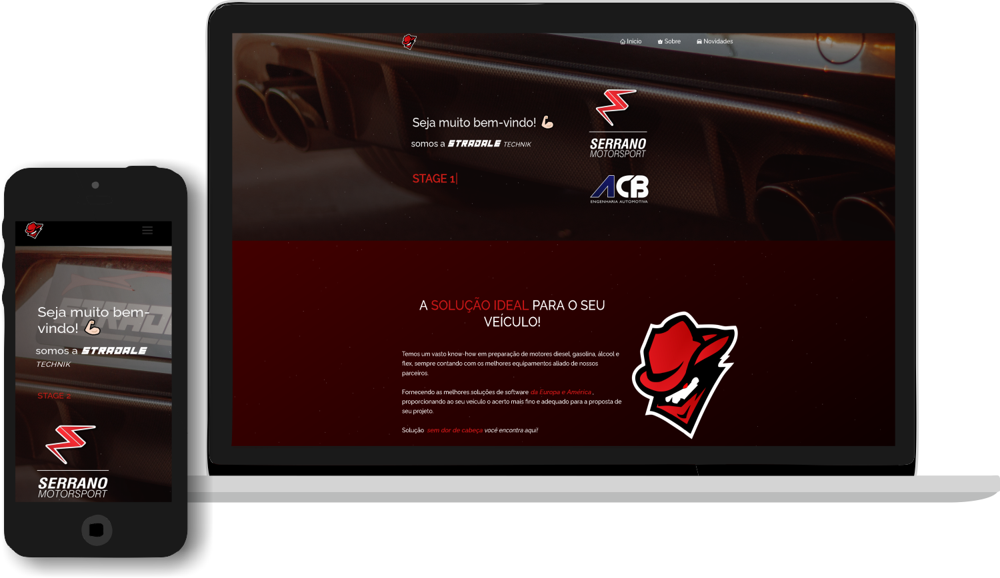

<h2 align="center">
  Stradale Technik Website  
  <a href="https://stradaletechnik.netlify.app/" target="_blank">Acesse o site 🔗</a>
</h2>

  

 

## O Projeto

Este projeto teve como objetivo apresentar o portfólio dos meus trabalhos no ramo automotivo,  praticar o uso das seguintes tecnologias:

- React.js
- Node.js
- Express.js
- CSS3
- VsCode
- Vercel

Usando o template que encontrei no GitHub do Soumyajit Behera, além do conteúdo estático e características da minha marca, fiz a integração com página do instagram @stradale.technik. Esta integração é feita através da API fornecida pelo Facebook Developers e faz a aquisição de 4 publicações por vez, e cada vez que o scroll chega ao final da página são requisitadas mais 4 publicações.

## Template

Características que gostei do template:

- 📖 Layout multi página
- 🎨 Estilizado com Reat-Bootstrap e Css de fácil customização de cores
- 📱 Totalmente responsivo

Thanks Soumyajit Behera!

## 🛠 Instalação e Configuração

1. Instalação: `npm install`

2. Para o rodar o projeto: `npm start`

Após rodar basta acessar pelo navegador http://localhost:3000.
